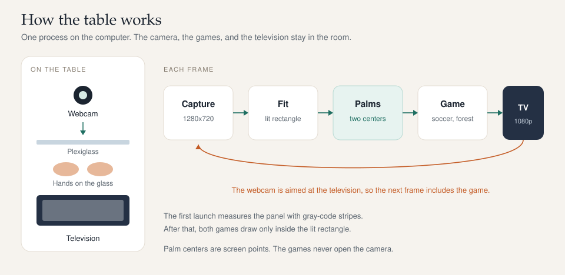
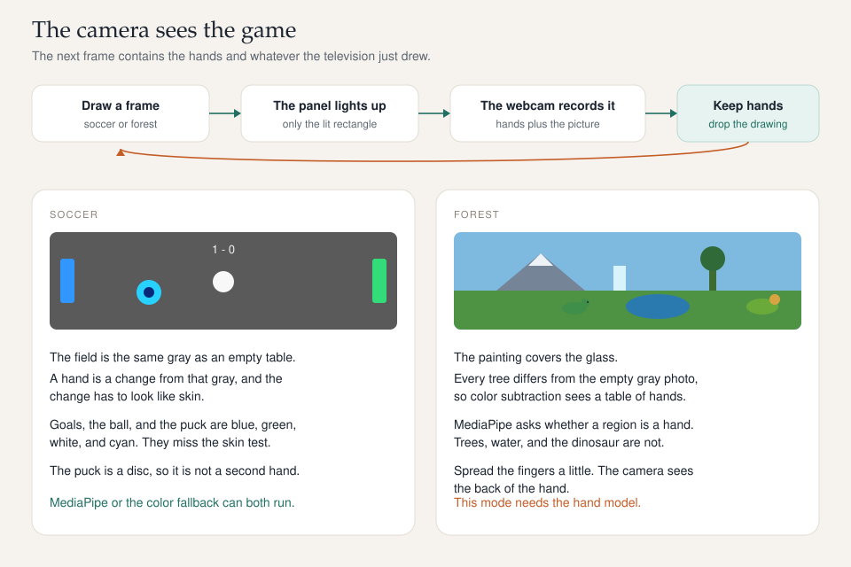

# Live Play

A table that plays with the hands on the glass. A television lies under a sheet of plexiglass, a webcam looks down at it, and one Python process draws the game. Nothing is uploaded. There is no account, and the program does not open a network connection while it runs.

Three games share that camera:

- **Soccer.** A puck sits on each palm and knocks a ball into the other goal.
- **Forest.** A dinosaur walks through the trees after the nearest hand, and plays at the waterfall, the lake, the rock, the mountain, and the flowers.
- **Flight.** Two pterodactyls sit on two hands and swoop through gaps in the branches. Press **5**. The first to 100 points gets confetti.
- **Garage.** Build a monster truck, then race it. Hover a shark, a mutt, a grave digger, a kraken, or a dragon. Each one has its own frame, welds, and body panels, so the build takes a while. Paint stays primer until you spray it on: a body color, a stripe, and flames, a bolt, or a plain finish. Then the truck still needs tires. Hover a tire for a second, then an axle, until both wheels are on. Six lug nuts come out of the nut bucket the same way. Hover the wrench, then a wheel, to tighten each nut. Hover **LET'S RACE**. Both tires on and every nut tight, and the truck wins the race in the colors you sprayed. A missed tire or nut and it crashes. After the finish, hover **RESET**. The bay has a looping shop riff, and each grab, weld, spray, tire, and wrench turn has its own effect. The winning finish switches to a faster loop. A crash stops the music on impact. Press **6**. If the computer has no speakers, the picture still runs.



## How a frame moves

The webcam is requested at 1280×720. The picture is cropped so it lines up with the television, then warped into the rectangle the panel actually lights. Many sets crop an HDMI image. The first launch on a real webcam paints gray-code stripes and reads them back, so later frames are drawn only on the glass. Press **G** to measure again. The result is stored in `calib/display_geometry.json`.

Each hand becomes a point: an x, a y, and a size, in screen pixels. The games follow those points. They do not open the camera themselves.

The tracker is MediaPipe’s Hand Landmarker. The model file ships with the repo at `models/hand_landmarker.task`, and the app does not download it. Linux runs it on the CPU. A Mac starts MediaPipe’s Metal helper, because that build aborts if the helper is left off. That GPU path leaks a graphics surface on every frame and, after a few minutes, aborts with “Error creating pixel buffer: -6662”. Live Play rebuilds the hand model before the cache fills, so a long session keeps tracking. If MediaPipe will not install, soccer can use a color tracker instead (`--vision diff+skin`). The forest, the flight, and the garage cannot: the painting would look like one large hand.

## The camera is looking at the screen



The next camera frame includes the hands and the picture that was just drawn. That loop decides what the games are allowed to look like.

Soccer stays a flat gray, the same gray as an empty table. The color tracker subtracts a snapshot of that gray and keeps a blob only when it is also skin-colored. The goals, the ball, the score, and the cyan puck miss that test. The puck is a disc, so the hand model does not treat it as another hand.

The forest, the flight, and the garage are full pictures. Color subtraction compares any of them with the gray snapshot and reports the whole scene. Those modes use MediaPipe, which is looking for a hand shape. Fingers spread a little help: the camera sees the back of the hand, and a flat fist is easy to miss.

Flight keeps the glass in blues and greens. The pterodactyl is smaller than the hand, and the wing is one membrane, so the fingertips stay visible around the palm. A limb that touches the body freezes that player for five seconds. Hover the reset control at the top left for three seconds to start over.

Reflections on the plexiglass still fool the color tracker. Dim the room if the pucks wander. The hand model is much less interested in a glare spot.

## Run

Python 3.10 or newer. Install once, then the table can run with the network unplugged.

```bash
python3 -m venv .venv
source .venv/bin/activate
pip install -r requirements.txt
python -m liveplay --list-displays
caffeinate -d python -m liveplay
```

`caffeinate` is macOS. It keeps the panel awake for that run. Quit with **Esc** or **Cmd+Q** (Ctrl+Q on other keyboards).

On Python 3.14, use the `pygame-ce` package from `requirements.txt`. The original `pygame` package has no 3.14 wheels. pip then builds it from source, and `pygame.font` crashes at startup. Operator text is drawn with OpenCV, but the window still needs pygame-ce:

```bash
pip uninstall -y pygame
pip install -r requirements.txt
```

The first launch measures the television and starts soccer. Later launches reuse the saved rectangle. MediaPipe does not ask for an empty-table photo. The color tracker does: clear the glass and press **Space**. That snapshot is `calib/empty_table.png`.

| Key | Action |
| --- | --- |
| 1 / 2 / 3 / 4 / 5 / 6 | Camera view, tracking circles, soccer, forest, flight, garage |
| G | Measure the television again |
| C, then Space | Snapshot an empty table for the color tracker |
| Arrows, Shift+arrows, S | Move, resize, and save the camera crop (views 1 and 2) |
| Esc, Cmd+Q, Ctrl+Q | Quit |

Turn off the television’s motion smoothing, and turn off overscan if the set has that setting. The panel’s own processing is usually a larger delay than this program.

```bash
python -m liveplay --mode forest
python -m liveplay --mode flight
python -m liveplay --mode garage
python -m liveplay --display 1
python -m liveplay --vision diff+skin   # soccer only, when MediaPipe is missing
python -m liveplay --windowed           # setup on the computer's own screen
```

`--fake-camera` runs without a webcam. It cannot see the stripes, so it skips the display scan.

## Tests

No webcam and no window:

```bash
python -m unittest discover -s tests -q
```

## Layout

```
config.json                  camera, display, and vision
models/hand_landmarker.task  local hand model
docs/                        the diagrams above
liveplay/app.py              modes and the main loop
liveplay/capture.py          webcam and the crop
liveplay/geometry.py         the display-limit scan
liveplay/hands.py            MediaPipe palm centers
liveplay/vision.py           color-blob fallback
liveplay/soccer.py           ball, pucks, and goals
liveplay/forest.py           the dinosaur and the forest
liveplay/flight.py           pterodactyls, branches, and confetti
liveplay/garage.py           monster truck tires, lug nuts, and the race
liveplay/assets/flight_sky.png   scrolling sky for the flight
liveplay/assets/garage/      shop, track, truck, tire, lug, wrench, bucket
liveplay/display.py          the table window
```
